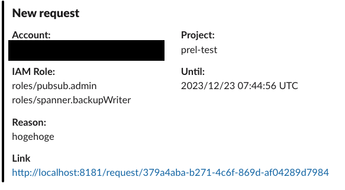

<h1>prel</h1>

**This repository is in the experimental stage. Non-backward compatible changes may be made frequently.**

<p align="center">
  
</p>

**prel**(iminary) is an application that temporarily assigns Google Cloud IAM Roles and includes an approval process.

It is inspired by [Qray](https://engineering.mercari.com/blog/entry/sre-qray/) from merpay.

<kbd></kbd>

<br>

**Table Of Contents**

- [Request Sequence](#request-sequence)
- [Getting Started](#getting-started)
- [How to use](#how-to-use)
  - [1. Sign in by Google Account as `Requester`](#1-sign-in-by-google-account-as-requester)
  - [2. Send Request as `Requester`](#2-send-request-as-requester)
  - [3. Judge the Request as `Judger`](#3-judge-the-request-as-judger)
  - [4. Invite new user as `Judger`](#4-invite-new-user-as-judger)
  - [5. Approve Request as `Judger`](#5-approve-request-as-judger)
  - [6. Check Google Cloud IAM setting](#6-check-google-cloud-iam-setting)
- [How to Deploy](#how-to-deploy)
- [`prel` Details](#prel-details)
  - [User Roles](#user-roles)
  - [User Management](#user-management)
    - [Invitation](#invitation)
    - [User Available](#user-available)
- [Running the tests](#running-the-tests)
- [Contributing](#contributing)
- [Versioning](#versioning)
- [Authors](#authors)
- [License](#license)
- [FAQ](#faq)
  - [Why don't basic roles appear in the role list?](#why-dont-basic-roles-appear-in-the-role-list)
  - [Why are some expected roles not listed?](#why-are-some-expected-roles-not-listed)
  - [What should be stored in the secret manager?](#what-should-be-stored-in-the-secret-manager)
  - [I can't sign-in locally due to a `Invalid Argument` error](#i-cant-sign-in-locally-due-to-a-invalid-argument-error)

<br>

## Request Sequence


<br>

## Getting Started

- [start manual](/docs/getting-started-manual.md)

## How to use
### 1. Sign in by Google Account as `Requester`

Log in with your Google Account.

This user will be referred to as the **requester**. If login fails, review the OAuth consent settings.

<p align="center">
  <kbd></kbd>
</p>

<br>

After logging in, a request form will appear.

<kbd></kbd>

<br>

### 2. Send Request as `Requester`

Select the Project ID, and a list of available Roles for that project will appear.

Please select the necessary Roles (multiple selections possible).

<kbd></kbd>

<br>

Set the Period to `1h` for subsequent work.(If the time is too short, the request will expire)

Once finished, press the Request button. You will then be redirected to the Pending page.

<kbd></kbd>

<br>

At this time, a notification is sent to Slack.

<p align="center">
  <kbd></kbd>
</p>

<br>

### 3. Judge the Request as `Judger`

Sign in to http://localhost:8181 with a different browser (not sharing the session).

This user will be referred to as the **judger**.

<br>

A `Not Invited` error will appear.

In this app, an invitation is mandatory for all users after the first registered user.

<p align="center">
  <kbd></kbd>
</p>

<br>

### 4. Invite new user as `Judger`

Now, return to the **requester's** screen and access http://localhost:8181/admin/user.

An invitation input area will be at the top right, where you should enter the **judger's** email address.

<kbd></kbd>

<br>

At this point, set the permission to `judger` and then press the Invite button.

<p align="center">
  <kbd></kbd>
</p>

<br>

### 5. Approve Request as `Judger`

Then, re-login as the **judger** and access http://localhost:8181/request.

You will see options to Approve / Reject. Let's try Approving.

<kbd></kbd>

<br>

### 6. Check Google Cloud IAM setting

If you have the correct Google Cloud permissions, [IAM](https://console.cloud.google.com/iam-admin/iam) will be updated with time condition.

<kbd></kbd>

<br>

and a notification will be sent to Slack.

<p align="center">
  <kbd></kbd>
</p>

<br>

## How to Deploy

- [deploy manual](/docs/deploy-manual.md)

<br>

## `prel` Details
### User Roles

| role \ action | request | judge(approve/reject) | delete own request<br>(only pending status) | delete others request<br>(only pending status) | judge own request |
| :-: | :-: | :-: | :-: | :-: | :-: |
| requester | ⭕️ | - | ⭕️ | - | - |
| judger | ⭕️ | ⭕️ | ⭕️ | - | - |
| admin | ⭕️ | ⭕️ | ⭕️ | ⭕️ | - |

user invitation can only admin role.

<br>

### User Management

#### Invitation

The first user to sign-in becomes an `Admin Role`, and thereafter, an invitation is required for participation.

**The email address of the Google Account** is needed for the invitation. Please note that no notifications, such as email, are sent; after inviting, the administrator should inform the invitee.

**Regular expressions, Google Groups, service accounts, or other non-user principals are not supported.**

The invitation is valid for `7 days`. If this period is exceeded, the invitation becomes invalid and must be re-invited.

---

#### User Available

This setting enables or disables users. Disabled users cannot sign-in or perform any operations.

Re-enabling allows them to operate again.

## Running the tests

```bash
make test
```

prel has following tests.

- unit test
- integration test
- e2e test

## Contributing

Please read [CONTRIBUTING.md](CONTRIBUTING.md) for details on our code of conduct, and the process for submitting pull requests to us.

## Versioning

We use [SemVer](http://semver.org/) for versioning.

For the versions available, see the [tags on this repository](https://github.com/lirlia/prel/tags).

## Authors

lirlia

## License

This project is licensed under the MIT License.

see the [LICENSE](LICENSE) file for details

## FAQ

### Why don't basic roles appear in the role list?

In Google Cloud, Role Binding using IAM Conditions for basic roles is not permitted, so they are not displayed.

<br>

### Why are some expected roles not listed?

This could be due to any of the following reasons:

- The role is not appearing because the API in Google Cloud is not enabled (for example, if the Spanner API is disabled, Spanner Roles will not be displayed).
- The role is not among the [grantable roles](https://cloud.google.com/iam/docs/viewing-grantable-roles?hl=en) in the target project.
- The role name partially matches `[sS]erviceAgent` (these roles are only assignable to service accounts and are therefore not displayed).

<br>

### What should be stored in the secret manager?

- client secret
- notification url

<br>

### I can't sign-in locally due to a `Invalid Argument` error

This is likely due to a discrepancy caused by deleting the database while the browser still retains cookies.

Please delete the cookies for this app.
