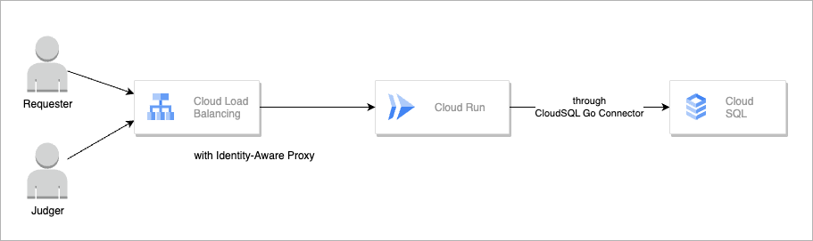

<h1>Deploy Manual</h1>

The recommended configuration is as follows:

- Cloud Run
- Cloud SQL
- Cloud SQL Connector

Here, we will introduce how to launch using these tools.

**Table Of Contents**

- [Google Oauth Pattern](#google-oauth-pattern)
  - [1. Create OAuth consent screen](#1-create-oauth-consent-screen)
  - [2. Create ClientID and ClientSecret](#2-create-clientid-and-clientsecret)
  - [3. Enable APIs](#3-enable-apis)
  - [4. Deploy Cloud SQL (Postgresql)](#4-deploy-cloud-sql-postgresql)
    - [Apply Schema](#apply-schema)
  - [5. Create Service Account](#5-create-service-account)
  - [6. Deploy Cloud Run](#6-deploy-cloud-run)
  - [7. Allowing public (unauthenticated) access](#7-allowing-public-unauthenticated-access)
  - [8. Push Image to own Image Registry](#8-push-image-to-own-image-registry)
  - [9. Re-deploy Cloud Run](#9-re-deploy-cloud-run)
  - [10. Add Authorized redirect URL](#10-add-authorized-redirect-url)
- [Identity-Aware Proxy Pattern](#identity-aware-proxy-pattern)
  - [1. Deploy Load Balancer and Set Identity-Aware Proxy](#1-deploy-load-balancer-and-set-identity-aware-proxy)
  - [2. Prepare](#2-prepare)

## Google Oauth Pattern


### 1. Create OAuth consent screen

see [README](../README.md)

### 2. Create ClientID and ClientSecret

see [README](../README.md)

**You don't need to insert any links at now.**

Please copy Client ID and Client secret.

### 3. Enable APIs

- [Cloud SQL Admin API](https://console.cloud.google.com/apis/library/sqladmin.googleapis.com)
- [Cloud Resource Manager API](https://console.cloud.google.com/marketplace/product/google/cloudresourcemanager.googleapis.com)
- [Cloud Run API](https://console.cloud.google.com/marketplace/product/google/run.googleapis.com)
- [Identity and Access Management (IAM) API](https://console.cloud.google.com/apis/library/iam.googleapis.com)

### 4. Deploy Cloud SQL (Postgresql)
set own environments.

```bash
export PROJECT_ID=OWN_PROJECT_ID
export REGION=xxxx
```

```bash
gcloud sql instances create prel \
  --database-version=POSTGRES_15 \
  --tier=db-f1-micro \
  --region=${REGION} \
  --quiet \
  --project=${PROJECT_ID}
```

After deployed, open Cloud SQL Page and set password of `postgres` user.

And Create Database `prel`.

```bash
gcloud sql databases create --instance prel prel --project "$PROJECT_ID" --region "$REGION"
```

#### Apply Schema

```bash
gcloud sql connect psql --database prel --project "$PROJECT_ID"
```

after display "password:", send `ctrl + c`.

This allows me to connect to Cloud SQL using my own IP address.

```bash
psql "host=x.x.x.x port=5432 dbname=prel user=postgres password=xxxxxx" -f db/schema.sql
```

### 5. Create Service Account

```bash
gcloud iam service-accounts create cloud-run-prel --project "$PROJECT_ID"
```

And add permissions.
```bash
gcloud projects add-iam-policy-binding "$PROJECT_ID" --member="serviceAccount:cloud-run-prel@${PROJECT_ID}.iam.gserviceaccount.com" --role="roles/cloudsql.client"

gcloud projects add-iam-policy-binding "$PROJECT_ID" --member="serviceAccount:cloud-run-prel@${PROJECT_ID}.iam.gserviceaccount.com" --role="roles/resourcemanager.projectIamAdmin"
```

### 6. Deploy Cloud Run

First deploy dummy Cloud Run for get url.

```bash
gcloud run deploy prel --image=nginx --port=80 --project "$PROJECT_ID" --region "$REGION"
```

### 7. Allowing public (unauthenticated) access

see [Allowing public (unauthenticated) access  |  Cloud Run Documentation  |  Google Cloud](https://cloud.google.com/run/docs/authenticating/public?hl=en)

### 8. Push Image to own Image Registry

Cloud Run cannot pull container images from sources other than Google Cloud's Container Registry / Artifact Registry, so you need to store the images yourself.

To download an image from ghcr, first log in with docker.

```bash
gh config get -h github.com oauth_token | docker login ghcr.io -u $(gh config get -h github.com user) --password-stdin
```

Then proceed to download.

```bash
export IMAGE_VERSION=latest # example
```

Download the image.

```bash
docker pull ghcr.io/lirlia/prel:$IMAGE_VERSION
```

Set the destination registry for the push.

```bash
export IMAGE_REGISTRY=xxx
```

Tag the image.

```bash
docker tag ghcr.io/lirlia/prel:$IMAGE_VERSION "$IMAGE_REGISTRY/prel:$IMAGE_VERSION"
```

Then push it.

```bash
docker push "$IMAGE_REGISTRY/prel:$IMAGE_VERSION"
```

### 9. Re-deploy Cloud Run

after copy Cloud Run app URL (like https://prel-3r3rs7gmzq-an.a.run.app)

Please copy the following `deploy.yaml` and replace the variables.

```yaml
apiVersion: serving.knative.dev/v1
kind: Service
metadata:
  annotations:
    run.googleapis.com/ingress: all
  labels:
    cloud.googleapis.com/location: xxxx <- set region
  name: prel
spec:
  template:
    metadata:
      annotations:
        autoscaling.knative.dev/maxScale: '1'
        run.googleapis.com/startup-cpu-boost: 'true'
    spec:
      containerConcurrency: 80
      containers:
      - env:
        - name: PROJECT_ID
          value: xxxx <- your google project id
        - name: NOTIFICATION_URL
          value: xxxx <- get Slack Incoming Webhook URL(if not set, skip notification)
        - name: AUTHENTICATION_TYPE
          value: google
        - name: CLIENT_SECRET
          value: xxxx <- get from OAuth consent
        - name: CLIENT_ID
          value: xxxx <- get from OAuth consent
        - name: URL
          value: xxxx <- Cloud Run URL(like https://prel-3r3rs7gmzq-an.a.run.app)
        - name: DB_PASSWORD
          value: xxxx <- get from Cloud SQL
        - name: DB_INSTANCE_CONNECTION
          value: xxxx <- get from Cloud SQL
        - name: DB_TYPE
          value: cloud-sql-connector
        image: xxx <- container image path
        name: prel-1
        ports:
        - containerPort: 8080
          name: http1
        resources:
          limits:
            cpu: 1000m
            memory: 512Mi
        startupProbe:
          failureThreshold: 1
          periodSeconds: 10
          tcpSocket:
            port: 8080
          timeoutSeconds: 10
      serviceAccountName: xxxx <- cloud-run-prel service account
      timeoutSeconds: 300
  traffic:
  - latestRevision: true
    percent: 100
```

Deploy it.

```bash
gcloud run services replace deploy.yaml --project "$PROJECT_ID"
```

### 10. Add Authorized redirect URL

Add following URL to client credentials.(created in step 2)

- https://prel-3r3rs7gmzq-an.a.run.app
- https://prel-3r3rs7gmzq-an.a.run.app/auth/google/callback

\* there are example, please set own urls.

that's all!

## Identity-Aware Proxy Pattern

If you have concerns about globally publishing Cloud Run, consider placing a Load Balancer in front of Cloud Run and setting up an Identity-Aware Proxy.

<kbd></kbd>

### 1. Deploy Load Balancer and Set Identity-Aware Proxy

see below, and another process is same as Google OAuth Pattern.

- [Setting up an external Application Load Balancer](https://cloud.google.com/iap/docs/load-balancer-howto?hl=en)
- [Set up a global external Application Load Balancer](https://cloud.google.com/load-balancing/docs/https/setup-global-ext-https-serverless?hl=en)
- [Managing access to IAP-secured resources](https://cloud.google.com/iap/docs/managing-access?hl=en)
- [Enabling IAP for Cloud Run](https://cloud.google.com/iap/docs/enabling-cloud-run?hl=en)


### 2. Prepare

You need to follow the same procedure as Google OAuth Pattern. Please follow from [3. Enable APIs](#3-enable-apis).

A different point is `deploy.yaml`. Please copy the following `deploy.yaml` and replace the variables.

```yaml
apiVersion: serving.knative.dev/v1
kind: Service
metadata:
  annotations:
    run.googleapis.com/ingress: internal-and-cloud-load-balancing
    run.googleapis.com/ingress-status: internal-and-cloud-load-balancing
  labels:
    cloud.googleapis.com/location: xxxx <- set region
  name: prel-with-iap
spec:
  template:
    metadata:
      annotations:
        autoscaling.knative.dev/maxScale: '1'
        run.googleapis.com/startup-cpu-boost: 'true'
    spec:
      containerConcurrency: 80
      containers:
      - env:
        - name: PROJECT_ID
          value: xxxx <- your google project id
        - name: NOTIFICATION_URL
          value: xxxx <- get Slack Incoming Webhook URL(if not set, skip notification)
        - name: AUTHENTICATION_TYPE
          value: iap
        - name: IAP_AUDIENCE
          value: /projects/xxxxxx/global/backendServices/xxxxxxxxxxxxxx
        - name: URL
          value: xxxx <- Cloud Run URL(like https://prel-3r3rs7gmzq-an.a.run.app)
        - name: DB_PASSWORD
          value: xxxx <- get from Cloud SQL
        - name: DB_INSTANCE_CONNECTION
          value: xxxx <- get from Cloud SQL
        - name: DB_TYPE
          value: cloud-sql-connector
        image: xxx <- container image path
        name: prel-1
        ports:
        - containerPort: 8080
          name: http1
        resources:
          limits:
            cpu: 1000m
            memory: 512Mi
        startupProbe:
          failureThreshold: 1
          periodSeconds: 10
          tcpSocket:
            port: 8080
          timeoutSeconds: 10
      serviceAccountName: xxxx <- cloud-run-prel service account
      timeoutSeconds: 300
  traffic:
  - latestRevision: true
    percent: 100
```
