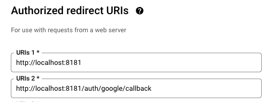
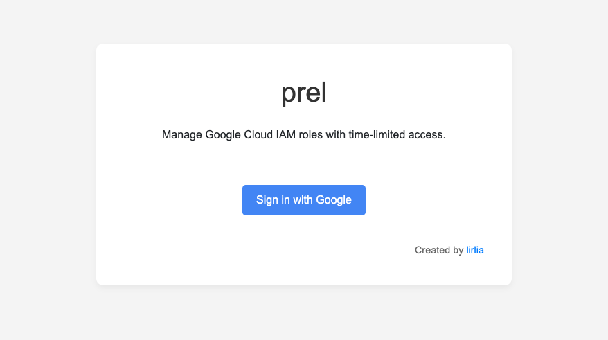

<h1>Getting Started</h1>

- [Prerequisites](#prerequisites)
- [Installing](#installing)
  - [1. Create Google OAuth consent screen and Client Secret](#1-create-google-oauth-consent-screen-and-client-secret)
  - [2. Enable APIs](#2-enable-apis)
  - [3. Create Slack Webhooks](#3-create-slack-webhooks)
  - [4. Run](#4-run)
  - [5. Access prel](#5-access-prel)

## Prerequisites

- 2 Google Account
- Google Cloud
- Go
- Docker
- Slack

## Installing

### 1. Create Google OAuth consent screen and Client Secret

Follow the instructions on this page to create an OAuth web client ID:

- [Create the OAuth web client ID](https://support.google.com/workspacemigrate/answer/9222992?hl=en)

When creating the client ID, register the following two URLs:

<p align="center">
  <kbd></kbd>
</p>

- http://localhost:8181
- http://localhost:8181/auth/google/callback

If setting the OAuth consent to external for testing, **register the two Google Accounts** you will use.

Then, obtain the Client ID and Client Secret.

### 2. Enable APIs

- [Cloud Resource Manager API](https://console.cloud.google.com/marketplace/product/google/cloudresourcemanager.googleapis.com)
- [Identity and Access Management (IAM) API](https://console.cloud.google.com/apis/library/iam.googleapis.com)

### 3. Create Slack Webhooks

- [Sending messages using Incoming Webhooks | Slack](https://api.slack.com/messaging/webhooks)

Then, obtain the incoming_webhook_url.

\* If you don't use slack, please skip.

### 4. Run

Please log in in advance.

```bash
gcloud auth login
```

```bash
gcloud auth application-default login
```

Run application.

```bash
ADDRESS=127.0.0.1 \
PROJECT_ID=[YOUR_GOOGLE_PROJECT_ID] \
NOTIFICATION_URL=[INCOMING_WEBHOOK_URL] \
CLIENT_SECRET=[CLIENT_SECRET] \
CLIENT_ID=[CLIENT_ID] \
make run
```

\* if you don't use slack, delete `NOTIFICATION_URL=[INCOMING_WEBHOOK_URL] \`

After starting the database and app.

```bash
Running...
[+] Building 0.0s (0/0)                       docker:desktop-linux
[+] Running 2/2
 ✔ Network prel_default  Created                              0.0s
 ✔ Container prel-db-1   Started                              0.0s
Running...
{"time":"2023-12-23T15:13:42.064352+09:00","severity":"INFO","caller":"/tmp/prel/cmd/prel/main.go:122","message":"Server started on 127.0.0.1:8181"}
```

### 5. Access prel

Access to http://localhost:8181

<kbd></kbd>
